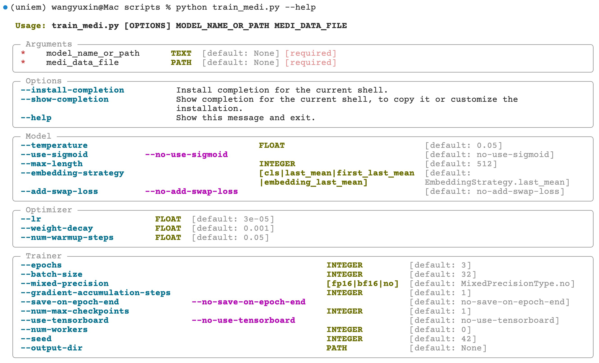

# uniem

> uniem 是 **UNI**fied **E**mbedding **M**odel 的缩写

**uniem 项目的目标是创建中文最好的通用文本嵌入模型**

本项目主要包括 Embedding 模型的训练脚本和评测脚本，模型和数据集会在 [HuggingFace](https://huggingface.co/) 社区上进行开源。

中文 Embedding 模型缺少统一的评测标准，所以我们参考了 [MTEB](https://huggingface.co/spaces/mteb/leaderboard) ，构建了中文评测标准 MTEB-zh，目前已经对 6 种模型在各种数据集上进行了横评，详细的评测结果请参考 [MTEB-zh](https://github.com/wangyuxinwhy/uniem/tree/main/mteb-zh) 。

如果您想要在 MTEB-zh 中添加评测数据集或者模型，欢迎提 issue 或者 PR，我会在第一时间进行支持，期待您的贡献！

## Model Releases

### 2023.06.08

第一期的模型 [M3E models](https://huggingface.co/moka-ai/m3e-base) 已经开源在了 HuggingFace 上，在中文文本分类和文本检索上都优于 `openai text-embedding-ada-002`，详请请参考 [M3E models README](https://huggingface.co/moka-ai/m3e-base/blob/main/README.md)。

## 使用 M3E

M3E 系列的所有模型在设计的时候就考虑到完全兼容 [sentence-transformers](https://www.sbert.net/) ，所以你可以通过**替换名称字符串**的方式在所有支持 sentence-transformers 的项目中**无缝**使用 M3E Models，比如 [chroma](https://docs.trychroma.com/getting-started), [guidance](https://github.com/microsoft/guidance), [semantic-kernel](https://github.com/microsoft/semantic-kernel) 。

### 安装 sentence transformers

```bash
pip install sentence-transformers
```

### 加载模型

```python
from sentence_transformers import SentenceTransformer

model = SentenceTransformer("moka-ai/m3e-base")
embeddings = model.encode(['Hello World!', '你好,世界!'])
```

## 训练/微调自己的模型

### 环境装备

1. 安装虚拟环境
```bash
conda create -n uniem python=3.10
```

2. 克隆并安装项目
克隆项目
```bash
git clone https://github.com/wangyuxinwhy/uniem.git
```

安装项目
```bash
pip install -e .
```


### 选择训练脚本

在调研和实践了大量文本嵌入相关的论文和模型后，我们选择通过在监督数据集上进行对比学习的方式来训练模型。uniem 在整个训练框架也是建立在此基础上，并对相关实体进行抽象。在 Uniem Embedding 模型中，主要有以下几个相关的元素：

- 预训练模型(pretrained_model)，比如 `bert-base-chinese`，`roberta-base` 等，未来会通过 SGPT 的方式支持 PreTrained Decoder
- 样本格式([RecordType](https://github.com/wangyuxinwhy/uniem/blob/main/uniem/data_structures.py))，目前支持句对样本，句子三元组样本，未来会支持句对分数样本
- 损失函数([ContrastLoss](https://github.com/wangyuxinwhy/uniem/blob/main/uniem/criteria.py))，目前支持 `SoftmaxContrastLoss` ， `SigmoidContrastLoss` 以及 `CoSentLoss`

uniem 实现了两个训练脚本，其中 `scripts/train_m3e.py` 是用来训练 M3E 系列模型的， `scripts/train_medi.py` 是用来复现 [instructor-embedding](https://github.com/HKUNLP/instructor-embedding/tree/main/InstructorEmbedding) 的。

对于 M3E 模型来说就是
```yaml
pretrained_model: hfl/chinese-roberta-wwm-ext
record_type: RecordType.PairRecord,
contrast_loss: PairSoftmaxContrastLoss
```

对于 INSTRUCTOR 模型来说就是
```yaml
pretrained_model: sentence-transformers/gtr-t5-large
record_type: RecordType.TripletRecord,
contrast_loss: TripletSoftmaxContrastLoss
```

### 训练中文 M3E 模型

1. 获取帮助, 查看可以设定的参数
```bash
python scripts/train_m3e.py --help
```

2. train embedding model
```bash
python scripts/train_m3e.py <model_path_or_name> <data_dir>
```

其中 `<model_path_or_name>` 可以是 HuggingFace 上的模型名称，例如 `hfl/chinese-roberta-wwm-ext` ，也可以是本地的模型路径， `<data_dir>` 是训练数据的路径。

脚本中是通过如下代码，对 `data_dir` 中的数据集进行读取的

```python
def load_all_datasets(m3e_datasets_dir: Path) -> list[M3EHfDatsetWithInfo]:
    m3e_datasets = []
    # 只会读取 data_dir 中的 .dataset 文件
    for data_dir in m3e_datasets_dir.glob('*.dataset'):
        dataset_name = data_dir.stem
        # .dataset 文件是通过 HuggingFace 的 save_to_disk 方法保存的，通过 load_from_disk 方法读取
        dataset_dict = load_from_disk(str(data_dir))
        if isinstance(dataset_dict, dict):
            dataset: HfDataset = concatenate_datasets(list(dataset_dict.values()))
        else:
            dataset = dataset_dict
        m3e_datasets.append(
            M3EHfDatsetWithInfo(
                hf_dataset=dataset,
                name=dataset_name,
            )
        )
        print(f'load {dataset_name}')
    return m3e_datasets
```

所以，如果你想要训练自己的模型，需要将数据集转换成 HuggingFace 的 [Dataset](https://huggingface.co/docs/datasets/loading_datasets.html) 格式，并通过 `save_to_disk` 方法保存成后缀为 `.dataset` 文件，然后将 `.dataset` 文件放到 `data_dir` 中。`Dataset` 中需要包含 `text` 和 `text_pos` 字段。

如果你觉得还是很困惑，可以参考 `scripts/process_zh_datasets.py` 中的代码

### 训练英文 INSTRUCTOR 模型

1. 获取帮助, 查看可以设定的参数

```bash
python scripts/train_medi.py --help
```

注意：由于代码更新的比较快，上图中的参数可能已经发生了变化，可以通过 `python scripts/train_medi.py --help` 来查看最新的参数。

2. train embedding model
```bash
python scripts/train_medi.py <model_path_or_name> <data_file>
```
其中 `<model_path_or_name>` 可以是 HuggingFace 上的模型名称，比如 `sentence-transformers/gtr-t5-large` ，也可以是本地的模型路径， `<data_file>` 是训练数据 json 的路径，比如 `medi.json`。 `medi.json` 可以在 [instructor-embedding](https://instructor-embedding.github.io/) 的项目中下载。
